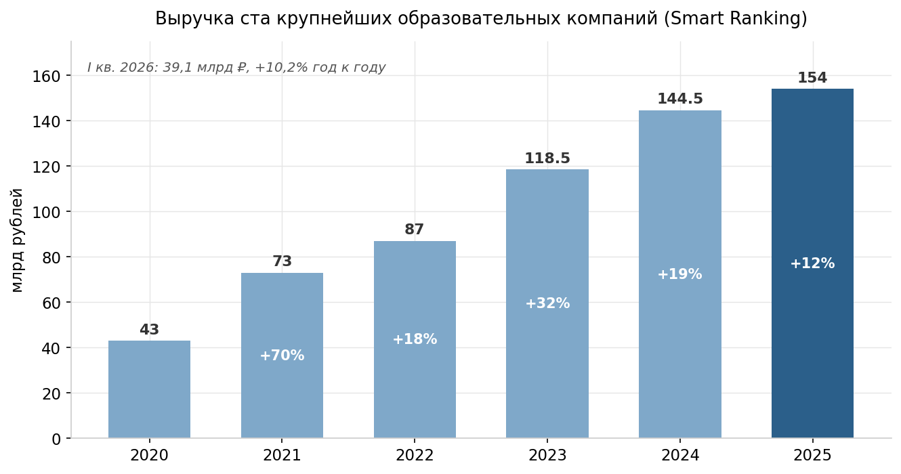
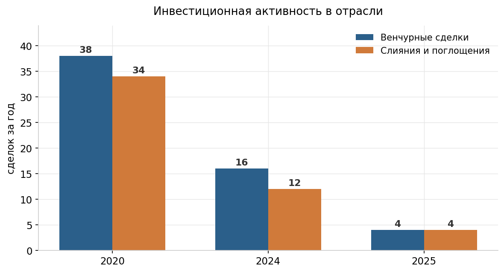
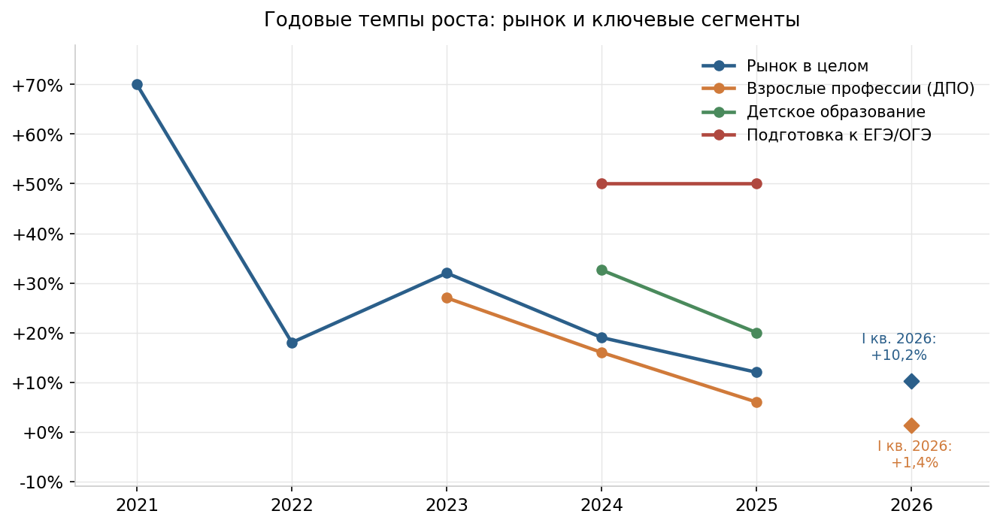
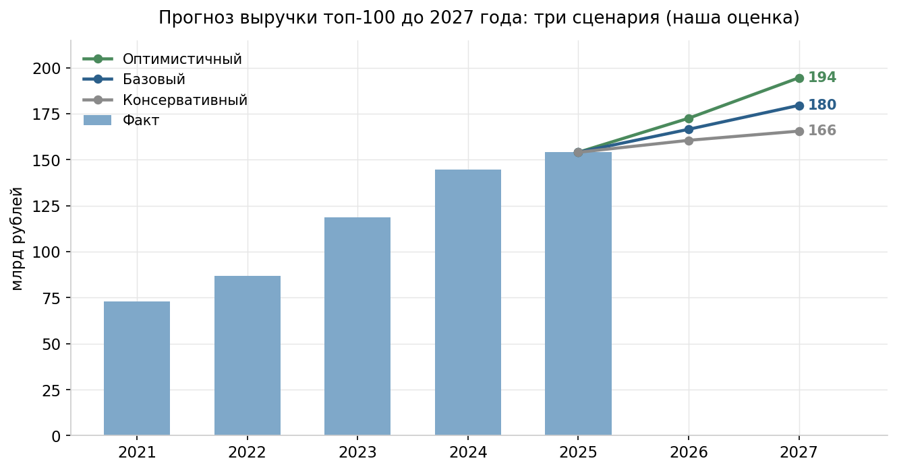

# Рынок онлайн-образования России: итоги 2022–2025, положение дел к середине 2026 года и прогноз до конца 2027-го

**Аналитический документ для стратегической сессии с партнёрами · июль 2026**

---

## 1. О чём этот документ

Перед вами обзор российского рынка онлайн-образования за последние четыре года и прогноз до конца 2027-го. Документ построен на опубликованных данных отраслевых аналитиков, деловой прессы и официальных правовых источников; ключевые цифры проходили перекрёстную проверку, а те, что проверку не прошли, исправлены или снабжены оговорками (их сводка — в разделе 12). Прогнозная часть — собственное построение: не предсказание, а продолжение видимых тенденций при явно названных допущениях. Каждый факт изложен один раз — там, где он уместнее всего; смежные разделы ссылаются друг на друга, а не повторяют сказанное.

---

## 2. Главное

Рынок прошёл путь от бума к зрелости: рост выручки ста крупнейших компаний замедлился с +70% (2021) до ~+12% (2025) и +10,2% в первом квартале 2026 года — с поправкой на инфляцию это почти остановка. Структура перевернулась: детское образование впервые стало крупнейшим сегментом, взрослые профессии встали, подготовка к ЕГЭ растёт на 50% в год. Сменился лидер («Синергия» вместо Skillbox), венчурные деньги ушли, их место заняли поглощения стратегами. Покупатель стал рациональным: меньше рассрочек, больше повторных покупок, суды на его стороне. Регулирование ужесточается через рекламные законы и уголовные дела против инфобизнеса.

Наш базовый прогноз: +7–9% в год в 2026–2027 годах, около 180 млрд рублей к концу 2027-го; реальный рост — 2–4%. Расти будут школьные сегменты, онлайн-дипломы и корпоративное обучение; оживление взрослого сегмента зависит от снижения ключевой ставки. Сценарии и допущения — в разделе 10, следствия для онлайн-школы — в разделе 11.

---

## 3. Как измеряют этот рынок

Почти все цифры о рынке восходят к одному источнику — ежеквартальному рейтингу ста крупнейших образовательных компаний агентства Smart Ranking. Когда «Коммерсантъ», Forbes и РБК называют размер рынка, они пересказывают именно его; согласие изданий между собой — точность пересказа, а не независимое подтверждение. Альтернативного измерения с другой методикой не существует.

При этом разные методики дают разные «размеры рынка», и путать их нельзя:

| Что измеряется | 2025 год | Комментарий |
|---|---|---|
| Панель топ-100 Smart Ranking | ~154 млрд ₽ | Крупнейшие технологичные компании; опорный ряд этого документа |
| Оборот рынка EdTech (BusinesStat) | ~166 млрд ₽ | Более широкое определение; уровень выше на 8–14%, динамика та же |
| Оборот школ на платформе GetCourse | ~158 млрд ₽ | «Длинный хвост»: десятки тысяч малых школ и инфобизнес; в 2025 году впервые упал (−6%) |
| Платные образовательные услуги (Росстат/ВШЭ) | ~1,29 трлн ₽ | Вся платная сфера, включая репетиторов и вузы; растёт лишь на ~3% в год |

Ещё одна тонкость: состав топ-100 меняется, и Smart Ranking пересматривает базу задним числом, поэтому опубликованные пары «объём + темп» не всегда сходятся арифметически. Пример: 154 млрд рублей за 2025 год относительно ранее объявленных 144,5 млрд за 2024-й дают около +6,6%, а не заявленные +12% — судя по всему, база была тихо пересмотрена вниз. Отсюда правило чтения всех цифр документа: направления и порядки величин надёжны (их подтверждают независимые смежные данные), точность абсолютных значений — «плюс-минус несколько процентов».

---

## 4. От бума к перестройке: динамика 2020–2026 годов

| Год | Выручка топ-100, млрд ₽ | Рост | Что происходило |
|---|---|---|---|
| 2020 | ~43 | — | Пандемия загоняет обучение в онлайн |
| 2021 | 73 | +70% | Пик бума; рекордные венчурные вложения (~14 млрд ₽) |
| 2022 | 87 | +18% | Февральский шок: падение продаж на 20–50%, уход западных платформ |
| 2023 | 118–119 | +31–32% | Восстановление на волне спроса на смену профессии |
| 2024 | 144,5 | +19% | Торможение; подъём ключевой ставки бьёт по рассрочкам |
| 2025 | 154 | ~+12%* | «Стагнация»: поквартально +16% → +10% → +12% → +10% |
| I кв. 2026 | 39,1 | +10,2% | «Перестройка»: год к году выросли лишь 60 компаний из ста |

*\*Об арифметической неувязке этой пары — см. раздел 3.*

За пятилетку 2019–2024 выручка топ-100 выросла примерно в десять раз — с 14 до 144,5 млрд рублей. Но природа роста менялась. До 2021 года рынок рос экстенсивно: в онлайн приходили новые аудитории, венчурные деньги оплачивали агрессивный маркетинг, обещание «войти в ИТ» продавало курсы само. С 2022 года каждый год добавлял по ограничителю: уход рекламных платформ и инвесторов, затем дорогой кредит, охлаждение найма в ИТ, усталость покупателя от навязчивых обещаний. К 2025 году ограничители пересилили: номинальные +10–12% при инфляции 8–10% — это реальный рост около нуля; Forbes назвал первое полугодие 2025-го, скорректированное на инфляцию, «эдтех-рецессией». Основатель Smart Ranking Дарья Рыжкова описывает 2025 год как «фактический переход к стагнации», а начало 2026-го — как смену «фазы роста на фазу перестройки»: внутри сотни лидеров выросла едва ли половина компаний, началось перераспределение долей.

Инвестиционная история — зеркало того же процесса. Венчурных сделок было 38 в 2020 году, 16 в 2024-м и лишь 4 в 2025-м; сделки слияний и поглощений сжались с 34 до 4. Сменился тип покупателя бизнеса: венчурный инвестор платил за ожидание кратного роста, которого больше нет, — пришли стратеги, для которых образование часть долгосрочной экосистемы (подробнее о сделках — раздел 6.2).

---

## 5. Сегменты: кто растёт, кто стоит, кто сжимается

### 5.1. Дети, школьники, экзамены — двигатель рынка

В 2025 году детское образование впервые стало крупнейшим сегментом: 36% рынка, около 55 млрд рублей, +20% за год. Ядро роста — подготовка к ЕГЭ и ОГЭ: 11,6 млрд рублей в 2024 году и около 19 млрд в 2025-м, по +50% два года подряд. Причины устойчивы: переток учеников от частных репетиторов к платформам, рост цен и образовательная политика, которая уводит часть девятиклассников в колледжи и тем самым обостряет конкуренцию за места в вузах. Лидеры ниши — «Умскул», «Стобалльный репетитор» (+118% за год, вход в национальную десятку), MAXIMUM Education. Рядом растёт полное онлайн-обучение вместо обычной школы: +27% за полугодие, почти 70 тысяч учеников у 25 крупнейших провайдеров.

Оговорки две. Во-первых, даже двигатель сбавляет обороты: поквартальный рост детского сегмента в 2025 году затухал с +32% до +9,4% — платящая аудитория крупных городов в значительной мере собрана. Во-вторых, внутри сегмента есть своя жертва: детские школы программирования, ниша-чемпион 2024 года (+36%), к концу 2025-го у многих игроков ушли в минус — родители перестали верить в «ИТ как гарантированную карьеру».

### 5.2. Взрослые профессии (ДПО) — остановка

Былое лицо рынка тормозит четвёртый год подряд: +27% (2023) → +16% (2024) → +6% (2025, 52,5 млрд рублей) → +1,4% (первый квартал 2026-го). Сегмент не падает, но стоит. Три причины: недоступная рассрочка (механика — в разделе 7.1), рекордно низкая безработица, лишившая людей мотива переучиваться, и охлаждение найма в ИТ (вакансий за 2025 год −12%), убившее главное обещание прошлых лет — «смени профессию и удвой доход». Классические курсы программирования, которым ИИ подорвал ценность, стагнируют или сжимаются.

Внутри стоячего сегмента одно быстрое течение — обучение работе с самим ИИ: спрос на курсы машинного обучения и анализа данных +60% за год, рынок «ИИ-навыков» для частных лиц — около 5 млрд рублей, курсы применения ИИ в маркетинге показывали кратный рост. Пока это ниша, но единственная в ДПО с настоящей динамикой.

Замедление подтверждается независимо: более широкий ряд РБК по всему рынку ДПО (включая офлайн) показывает то же торможение при втрое большем периметре.

### 5.3. Партнёрства с вузами и колледжами — новый источник роста

К осени 2025 года аналитики называли главным источником роста рынка онлайн-программы высшего и среднего профессионального образования: у «Синергии» +29% за год («втрое быстрее рынка»), сегмент онлайн-дипломов консорциума СОВО +36% и рост в шесть с половиной раз с 2021 года. Логика: диплом государственного образца — то, чего у онлайн-курсов никогда не было, а к нему прилагаются государственные образовательные кредиты, отсрочка от службы для студентов колледжей и понятная траектория трудоустройства. Онлайн-компании начали покупать формальное образование как актив (сделка Skyeng — раздел 6.2).

### 5.4. Языки — плато

Рост около +3% в год, то есть сжатие в реальном выражении; в начале 2026-го — динамика от нулевой до отрицательной. После ухода иностранных игроков ниша консолидировалась вокруг Skyeng и Novakid. Парадокс: языки — самая популярная тема у учащихся (21% опрошенных), но популярность не конвертируется в выручку — бытовые задачи закрывают бесплатные ИИ-переводчики, а мотив «английский для карьеры» ослаб.

### 5.5. Хобби и мягкие навыки — малый и плохо измеренный сегмент

Около 12% учащихся при среднем чеке ~24 тысячи рублей (против ~52 тысяч у профессиональных курсов). Качественной статистики нет; смежный массовый инфобизнес на GetCourse в 2025 году сократился на 5–6%.

### 5.6. Корпоративное обучение — тихая гавань

Пока частный покупатель экономил, корпоративный платил: продажи Яндекс Практикума компаниям +30% за 2025 год, у поставщиков систем корпоративного обучения — до +40% за полугодие. Двигатели — кадровый голод, импортозамещение и волна внедрения ИИ: корпоративные ИИ-курсы растут втрое быстрее остальных. Оценки объёма ниши расходятся (8 млрд рублей за корпоративное ИТ-обучение; до 91 млрд за весь рынок по широкой методике), но устойчивость спроса сомнений не вызывает. Контраст — бизнес-образование для частных лиц (MBA и управленческие программы): худший сегмент 2025 года, −12%.

---

## 6. Игроки: новая иерархия

### 6.1. Первая десятка

| № | Компания | 2024, млрд ₽ | 2025, млрд ₽ | Рост за 2025 | Владелец / примечание |
|---|---|---|---|---|---|
| 1 | Синергия | 12,7 | 16,1 | +26% | Независимая; лидер с 2024 года |
| 2 | Skillbox Holding | 12,2 | 12,8–12,9 | +5% | VK; включает Skillbox, GeekBrains, Skillfactory |
| 3 | Skyeng | 12,1 | 12,7–12,8 | +5% | Независимая |
| 4 | Яндекс Практикум | 8,3 | 8,8 | +7% | Яндекс |
| 5 | Учи.ру | 5,2 | 7,2 | +18% | VK |
| 6 | GetCourse | 6,7 | 6,6 | −2% | Платформа; первое падение в истории |
| 7 | Фоксфорд | 5,2 | 5,8 | +12% | Сбербанк (с октября 2024) |
| 8 | Умскул | 4,8 | 5,3 | +34% | VK — миноритарный пакет |
| 9 | Актион Университет | 4,5 | 5,2 | +16% | |
| 10 | Стобалльный репетитор | — | 4,4 | +118% | Новичок десятки; подготовка к ЕГЭ |

Таблица рассказывает историю рынка лучше любого текста. Наверху — «Синергия», выросшая на онлайн-дипломах. Былой флагман Skillbox, возглавлявший рейтинг тринадцать кварталов из шестнадцати в 2021–2024 годах, растёт на уровне инфляции, а в первом квартале 2026-го потерял 11% выручки. Быстрее всех — экзаменационные школы. За большинством строк стоят три экосистемы: VK, Сбербанк и Яндекс; независимых тяжеловесов двое — «Синергия» и Skyeng.

### 6.2. Сделки и несостоявшиеся IPO

Ключевые сделки полутора лет складываются в один сюжет. Сбербанк купил «Нетологию» и «Фоксфорд» (октябрь 2024-го, оценочно 4–6 млрд рублей; доля Сбера на рынке выросла с 1% до ~7%). Skyeng приобрёл 51% компании с частным университетом МАБиУ и колледжем (сентябрь 2025-го). «Просвещение» вошло в капитал Eduson и Karpov Courses. Сделок мало (четыре за 2025 год), но каждая стратегическая: покупают не рост, а позицию.

Биржевых размещений при этом не случилось ни одного, хотя готовились минимум четверо: Skillbox перерегистрировался с Кипра в Калининград (прочитано рынком как подготовка к IPO), «Синергия» обсуждает размещение в горизонте 2025–2027 годов, Ultimate Education заявлял о планах, но съехал в убыток при падении выручки на треть, IPO Skyeng так и осталось слухом 2024 года. Пока деньги дороги, окно закрыто; его открытие — вопрос ключевой ставки (прогноз — раздел 10.5).

Тёмная сторона консолидации — крах прежней модели. Like Center Аяза Шабутдинова, в 2021 году третья компания страны с ~6 млрд рублей выручки, к 2025-му сжался, по имеющимся данным, до ~20 млн и подал на банкротство; сам основатель осуждён (о волне уголовных дел — раздел 8.3).

---

## 7. Покупатель: как теперь продаётся образование

### 7.1. Рассрочка и цена денег

Дорогие курсы в России продаются в рассрочку, поэтому подъём ключевой ставки с 16% до 21% в 2024 году ударил по несущей конструкции рынка. По оценке платёжного сервиса Prodamus (единственный источник, но направление подтверждается общебанковской статистикой), доля одобряемых заявок на рассрочку упала с ~80% до ~20%. Зависимость продаж от заёмных денег резко растёт с ценой: по платёжным данным Центрального университета (52 млн человек), при чеке до 15 тысяч рублей в рассрочку покупает ~1% клиентов, при чеке 120–200 тысяч — 35%, в отдельных категориях до 42%. Именно поэтому сильнее всего пострадали дорогие программы: курсы дороже 100 тысяч рублей теряют долю в платежах.

Школы приспособились трояко: модульные планы оплаты по этапам обучения вместо банковской рассрочки; сервисы разбивки платежа (Яндекс Сплит, «Подели», Mokka), обходившие кредитные бюро, — лазейка закрылась с апреля 2026 года (283-ФЗ обязал передавать такие рассрочки в бюро); снижение чека и дробление продуктов. Добавился «период охлаждения» по кредитам (с сентября 2025-го): 48 часов ожидания при сумме свыше 200 тысяч рублей — прямой удар по продажам «здесь и сейчас, пока действует скидка».

### 7.2. Доверие, возвраты, суды

Кризис доверия к отрасли — прямое следствие уголовных дел против звёзд инфобизнеса (раздел 8.3) и историй обманутых покупателей. Деньгами его первым почувствовал массовый сегмент: оборот школ на GetCourse в 2025 году впервые упал (динамика — раздел 3), жалобы в Рособрнадзор за три квартала 2025 года выросли более чем на 30%. Ответ отрасли — формализация: выданных лицензий на дополнительное профессиональное образование стало 1140+ к третьему кварталу 2025 года против сотен и десятков ранее; лицензия превратилась в знак качества, который выносят на первый экран сайта.

Судебная практика по возвратам сложилась в пользу потребителя. Ориентир — определение Верховного суда от 14 ноября 2024 года по делу против GeekBrains: при существенных недостатках услуги покупатель вправе вернуть деньги за все непройденные уроки; условия «после открытия доступа возврат невозможен» признаются ничтожными, сверх возврата взыскиваются моральный вред и 50-процентный штраф. GeekBrains выплатил ~23,5 млн рублей по 155 спорам (в основном досудебно, из-за незаконных условий возврата, а не качества курсов); Skillbox получил групповой иск из-за пункта о невозвратных 30%. Вывод для экономики школ: удержание денег юридическими конструкциями не работает, возвраты — операционная данность.

### 7.3. Новая воронка: удержание вместо привлечения

В ноябре 2023 года на массовом рынке случился перелом: повторные покупки впервые принесли больше денег, чем продажи новым клиентам; к концу 2025-го на них приходилось 58% выручки. Причина — стоимость привлечения: после гибели рекламных каналов (по отраслевым оценкам, до 2022 года до 80% клиентов приводили запрещённые ныне соцсети) она выросла у малых и средних школ на 20–60% за один 2024 год. Единственным растущим каналом остался Телеграм (рекламные бюджеты образования там +55–79% за 2025 год), но с февраля 2026-го и он работает с перебоями.

Поменялось и поведение аудитории: 53% покупателей приходят через целенаправленный поиск программы и лишь 28% — откликнувшись на рекламу; агрессивные автовебинары уступили место диагностикам, пробным урокам и продуктовым линейкам. Платит покупатель осторожно: средний чек массового сегмента (~11 тысяч рублей) растёт вровень с инфляцией, средняя цена профессионального курса — ~52 тысячи, а планы расходов на обучение традиционно вдвое превышают факты (52 тысячи заявленных на 2026 год против 32 тысяч потраченных в 2025-м).

---

## 8. Регулирование: что действительно ужесточилось

Специального «закона об онлайн-образовании» не появилось — государство ужесточило правила через смежные нормы, и для практики это оказалось не менее чувствительно.

### 8.1. Реклама — самый болезненный фронт

| Норма | Суть | Действует с |
|---|---|---|
| Маркировка интернет-рекламы (274-ФЗ) | Регистрация креативов; штрафы для юрлиц 200–500 тыс. ₽ | штрафы — с сентября 2023 |
| Запрет рекламы у иноагентов | Закрыл канал блогерских интеграций (640+ млн ₽ в год для отрасли) | март 2024 |
| Регистрация блогеров (303-ФЗ) | Каналы от 10 тыс. подписчиков — в реестр Роскомнадзора; без регистрации реклама запрещена | ноябрь 2024 |
| Запрет налогового вычета (416-ФЗ) | Немаркированная реклама и реклама на заблокированных площадках — не в затраты | 2025 |
| Сбор 3% с интернет-рекламы (479-ФЗ) | Отчисление с доходов от размещения | апрель 2025 |
| Запрет рекламы на площадках экстремистских организаций (72-ФЗ) | Реклама в Instagram и Facebook формально вне закона; штрафы до 500 тыс. ₽ | сентябрь 2025 |

Масштаб потерь показателен: в 2023 году крупнейшие школы наращивали блогерские интеграции темпом +305% за год — весь инструментарий закрылся за два года, а рекламная инфляция в оставшихся каналах достигает 20% в год (последствия для воронки — раздел 7.3).

### 8.2. Лицензии и надзор

Лицензия требовалась и раньше — изменилось правоприменение: за десять месяцев 2024 года Рособрнадзор вынес 334 постановления против работающих без лицензии, штрафы, по сообщениям юристов, повышены до 100–300 тысяч рублей. Отдельный «закон об инфобизнесе» (лицензии для физлиц, запрет называться «академией», обязательные оговорки о негарантированности результата) обсуждается с 2024 года, но остаётся законопроектом; при этом 53% участников рынка ждут новых норм. Для модели вузовских партнёрств появился свой риск — 114-ФЗ (май 2025-го) дал правительству право ограничивать платный приём в вузы. Циркулирующие утверждения об обязательной госаккредитации онлайн-школ первичными источниками не подтверждаются.

### 8.3. Уголовные дела

Точку в истории «инфобизнеса на харизме» поставили приговоры: Елена Блиновская — 5 лет (после апелляции 4,5 года) по делу об отмывании на фоне налоговых претензий почти на миллиард рублей; Артём Чекалин — 7 лет со штрафом почти 200 млн; Аяз Шабутдинов — 7 лет за мошенничество по 113 эпизодам; продолжаются дела Валерии Чекалиной и Саши Митрошиной. Сигнал прочитан однозначно: продажа «успешного успеха» токсична юридически и репутационно, аудитория и деньги перетекают к лицензированным школам и формальному образованию.

---

## 9. Что прогнозируют участники рынка

Опубликованные ожидания на 2026 год сходятся в узком коридоре. Smart Ranking ориентирует на ~+10% в год силами детских сегментов и вузовских партнёрств; EVOLYUT даёт вилку 10–15% (из этого источника мы используем только её — прочие цифры автора не прошли проверку, см. раздел 12). Панель руководителей компаний называет три темы года: гибель модели чистой закупки трафика (Крутов, Skillbox), вузовские партнёрства как точку роста (Курмышев, Яндекс Практикум) и проверку больших гипотез об ИИ (Сумбатян, IThub). Опрос РБК/GetCourse фиксирует: 53% участников ждут новых профильных законов, а ИИ рынок видит прежде всего как внутреннюю автоматизацию. Мировой фон тот же: ускорение слияний, вдвое меньше молодых стартапов в глобальном топе, слияние Coursera и Udemy как символ консолидации.

Существенный пробел: количественных прогнозов на 2027 год никто не публикует — все останавливаются на 2026-м и качественных формулировках. Поэтому цифры следующего раздела — наше собственное построение.

---

## 10. Наш прогноз до конца 2027 года

### 10.1. Отправная точка и макроусловия

Рынок входит во вторую половину 2026 года с темпом ~+10% и его медленным снижением. Макрофон впервые за два года играет за рынок: ключевая ставка снижена девятью последовательными шагами до 14,25% (июнь 2026-го) против пиковых 21%, годовая инфляция ~6%, прогноз ЦБ — 4,5–5,5% за 2026 год и возврат к цели 4% в 2027-м. Для рынка, живущего рассрочкой, траектория ставки — главная внешняя переменная.

### 10.2. Логика: пять зависимостей

Прогноз строится не на экстраполяции одной кривой, а на пяти зависимостях, видимых в данных предыдущих разделов.

**Ставка → рассрочки → дорогие программы.** Механика раздела 7.1 работает в обе стороны: снижение ставки будет возвращать заёмного покупателя. Эффект придёт с запозданием и не полностью — рассрочки теперь видны кредитным бюро, действует период охлаждения, банки осторожны. Оживления взрослого сегмента разумно ждать не раньше конца 2026 — 2027 года.

**Рынок труда → спрос на смену профессии.** ДПО остановилось при рекордно низкой безработице (раздел 5.2). Охлаждение рынка труда, обычно следующее за жёсткой денежной политикой с лагом, парадоксальным образом сыграло бы сегменту на руку; в базовый сценарий мы его не закладываем, но это скрытый потенциал отскока.

**Демография → школьные сегменты.** Рождаемость в России росла до пика 2014–2016 годов (~1,9 млн в год), поэтому численность старшеклассников и сдающих ЕГЭ будет увеличиваться примерно до начала 2030-х. Однако проникновение онлайн-подготовки в крупных городах уже высоко (раздел 5.1), так что рост сегмента замедлится с +20% до 10–15% в год: демография и цены вместо освоения новой аудитории.

**Зрелость → экономика удержания.** Показатели раздела 7.3 (повторные покупки 58% выручки, осознанный поиск 53% против 28% рекламы) — классические индикаторы зрелого рынка, а зрелые рынки растут на уровне «инфляция плюс несколько пунктов» и перераспределяются в пользу эффективных. Этот режим мы считаем базовым на всём горизонте.

**Регуляторный фон → барьеры.** Тенденции раздела 8 повышают издержки и порог входа, но не запрещают деятельность — это фактор перераспределения рынка в пользу крупных и лицензированных, а не его сжатия.

### 10.3. Три сценария

Цифры относятся к панели топ-100 Smart Ranking (номинальная выручка) и сравнимы только с этим рядом; точность унаследована от него (раздел 3).

| Сценарий | 2026 | 2027 | Ключевые условия |
|---|---|---|---|
| **Консервативный** (≈25%) | +3–5% (~159–162 млрд ₽) | +2–4% (~163–168 млрд ₽) | Ставка снижается медленно; инфляция выше прогноза; ограничения Телеграма бьют по последнему каналу; жёсткая версия закона об инфобизнесе; детский сегмент насыщается быстрее. Номинальная стагнация = реальное падение |
| **Базовый** (≈55%) | +7–9% (~165–168 млрд ₽) | +7–9% (~177–182 млрд ₽) | Ставка к концу 2026-го 11–12%, к концу 2027-го ~9–10%; инфляция по траектории ЦБ; рассрочки оживают со второй половины 2026 года; без регуляторных шоков. Реальный рост 2–4% в год |
| **Оптимистичный** (≈20%) | +11–13% (~171–174 млрд ₽) | +12–14% (~192–197 млрд ₽) | Быстрое смягчение денежной политики; охлаждение рынка труда возвращает спрос на переобучение; ИИ-продукты монетизируются как отдельная категория |

Даже оптимистичный сценарий не возвращает рынок к темпам 2021 или 2023 годов — и это не осторожность, а арифметика зрелости: у крупнейшего сегмента видимое насыщение, у второго — структурные ограничения. Для возврата к +30% нужен новый массовый продукт масштаба «войти в ИТ» образца 2020 года; кандидата не видно, а ближайший претендент — обучение работе с ИИ — пока на порядок меньше.

### 10.4. Прогноз по сегментам (базовый сценарий)

| Сегмент | 2025 (факт) | 2026 (прогноз) | 2027 (прогноз) | Ключевой фактор |
|---|---|---|---|---|
| Детское образование в целом | +20% | +12–15% | +10–13% | Демография «за»; насыщение крупных городов «против» |
| — в т.ч. подготовка к ЕГЭ/ОГЭ | +50% | +25–35% | +20–25% | Переток от репетиторов продолжается |
| Взрослые профессии (ДПО) | +6% | 0–3% | +3–6% | Оживление вслед за ставкой, с лагом |
| Партнёрства с вузами и колледжами | +29–36% | +20–30% | +15–25% | Самый динамичный сегмент; риск — 114-ФЗ |
| Языки | ~+3% | −2…+2% | −2…+2% | Давление бесплатных ИИ-инструментов |
| Корпоративное обучение | +30% (по лидерам) | +10–15% | +10–15% | Кадровый голод, внедрение ИИ |
| Бизнес-образование частных лиц | −12% | −5…0% | 0…+5% | Дно близко; восстановление вместе с рассрочками |
| Массовый инфобизнес (вне топ-100) | −6% | −5…0% | −3…+2% | Продолжение очищения ниши |

### 10.5. Качественные ожидания

**Консолидация ускорится:** порядок 5–10 значимых сделок в год против четырёх в 2025-м — снижение ставки удешевляет покупки, покупатели те же (экосистемы, «Просвещение», лидеры сегментов), кандидаты — средние школы с сильным продуктом и дорогим привлечением. **Первое образовательное IPO** становится реальным ближе к 2027 году при ставке ниже 10–12%; наиболее готовы «Синергия» и Skillbox Holding — рынок получит первую публичную оценку образовательного бизнеса. **Закон об инфобизнесе,** вероятно, будет принят в умеренной версии (раскрытие информации, ограничения на обещания, возможно реестр физлиц) — для лицензированных школ скорее плюс. **ИИ уйдёт в себестоимость:** главный эффект на горизонте — не новые продукты, а дешевле проверка заданий, кураторство, персонализация и производство контента.

**Чего в прогнозе нет:** резких геополитических сдвигов в обе стороны (возвращение западных платформ радикально изменило бы экономику привлечения), полной блокировки значимых каналов трафика, макроэкономических шоков. Любое из этих событий потребует пересчёта — честнее сказать это прямо, чем прятать неопределённость в широкие вилки.

---

## 11. Что из этого следует для онлайн-школы

Восемь тезисов для повестки сессии — каждый опирается на разделы выше, здесь только выводы.

**1. Планировать долю, а не волну.** План «рынок вырастет на 30%» нереалистичен; рабочий план — «взять долю в сегменте, растущем на 15%».

**2. Удержание — главный рычаг.** Ключевые вопросы: есть ли что продать выпускнику первого курса, выстроена ли линейка-лестница, измеряется ли доля возвращающихся так же внимательно, как стоимость привлечения.

**3. Зависимость от одного канала — главный операционный риск.** Каналы гибнут один за другим четыре года подряд; устойчива модель с растущей долей органики — сообщество, рекомендации, контент, партнёрства.

**4. Платёжную модель — проектировать заново.** Модульная оплата по этапам, умеренные чеки, прозрачные возвраты — уже не антикризисные меры, а норма; следить за ставкой как за главным индикатором спроса на дорогие продукты.

**5. Юридическая гигиена — конкурентное преимущество.** Лицензию, маркировку и честную оферту выносить в маркетинг, а не прятать в подвал сайта: на фоне кризиса доверия это продаёт.

**6. Самые перспективные связки — с формальным образованием.** От партнёрских программ с вузами и колледжами до сетевых форм; крупнейшие игроки уже двигаются туда сделками.

**7. ИИ — в операционную модель, а не в лозунги.** Сокращать себестоимость проверки, кураторства и контента; «ИИ-курс ради ИИ в названии» покупатель распознаёт мгновенно.

**8. Если обсуждается продажа или партнёр — сейчас рынок покупателя.** Оценки скромные, но стратеги активны; готовность к сделке (прозрачная отчётность, чистая структура, управляемая зависимость от основателя) стоит создавать заранее.

---

## 12. О точности цифр

Несколько широко цитируемых утверждений о рынке не прошли проверку; в документе они исправлены, но на сессии могут всплыть в дискуссии — полезно знать их реальный статус. «Рынок вырос на 12% в 2025 году» — с ранее опубликованной базой сходится лишь ~6,6% (раздел 3). «25% платят в рассрочку» — усреднение бессмысленно: доля колеблется от 1% до 35–42% в зависимости от цены (раздел 7.1). «Одобрения рассрочек упали с 80% до 20%» — оценка единственного источника, не статистика. «GeekBrains проиграл 155 судов из-за качества курсов» — в действительности преимущественно досудебные выплаты из-за незаконных условий возврата. Штрафы за немаркированную рекламу для юрлиц — от 200, а не от 100 тысяч рублей. Обязательная госаккредитация онлайн-школ — не подтверждается. «ДПО уйдёт в минус в 2026-м» — опровергнуто фактом первого квартала (+1,4%). Прочие цифры источника EVOLYUT, кроме вилки 10–15%, не воспроизводятся по первоисточникам.

---

## 13. Источники

**Рынок и рейтинги:** Smart Ranking / edtechs.ru (годовые и квартальные отчёты топ-100, 2022–2026); «Коммерсантъ»; Forbes; Интерфакс; «Ведомости»; РБК Тренды; BusinesStat; TAdviser; данные ВШЭ о платных образовательных услугах.

**Сегменты:** ComNews; отчёты Smart Ranking по экзаменационной подготовке; ежегодный опрос учащихся «Нетологии» (2025); РБК Тренды (корпоративное обучение, онлайн-высшее, СОВО).

**Игроки и сделки:** Skillbox Media; Sostav; Forbes (сделка Сбера, перерегистрация Skillbox); «Коммерсантъ»; TAdviser (отчётность компаний); Интерфакс (образовательный сегмент VK); RTVI (Like Center).

**Покупатель:** «Коммерсантъ» (рассрочки по данным Центрального университета/Т-Данные); Smart Ranking и GetCourse (повторные покупки, чеки, массовый сегмент); РАПСИ, Право.ру (определение ВС 4-КГ24-57-К1); Forbes и «Коммерсантъ» (выплаты GeekBrains); Sostav (иск к Skillbox, рекламный рынок).

**Регулирование:** официальные тексты 274-ФЗ, 303-ФЗ, 416-ФЗ, 479-ФЗ, 72-ФЗ, 114-ФЗ, 283-ФЗ и закона о «периоде охлаждения» (pravo.gov.ru, КонсультантПлюс, Гарант); «Ведомости»; Интерфакс, РАПСИ, ТАСС (приговоры); законопроект № 884102-8 (СОЗД).

**Прогнозы и макро:** панель руководителей edtechs.ru (январь 2026); Smart Ranking об инвестициях (январь 2026); опрос РБК/GetCourse (январь 2026); vc.ru (EVOLYUT, с оговорками раздела 12); HolonIQ через деловую прессу; Банк России (решение по ставке 19.06.2026, прогноз инфляции); Росстат/Интерфакс (инфляция, июнь 2026).

---

*Документ подготовлен в июле 2026 года. Прогнозные оценки отражают состояние данных на момент подготовки и подлежат пересмотру при существенном изменении макроэкономических или регуляторных условий.*
